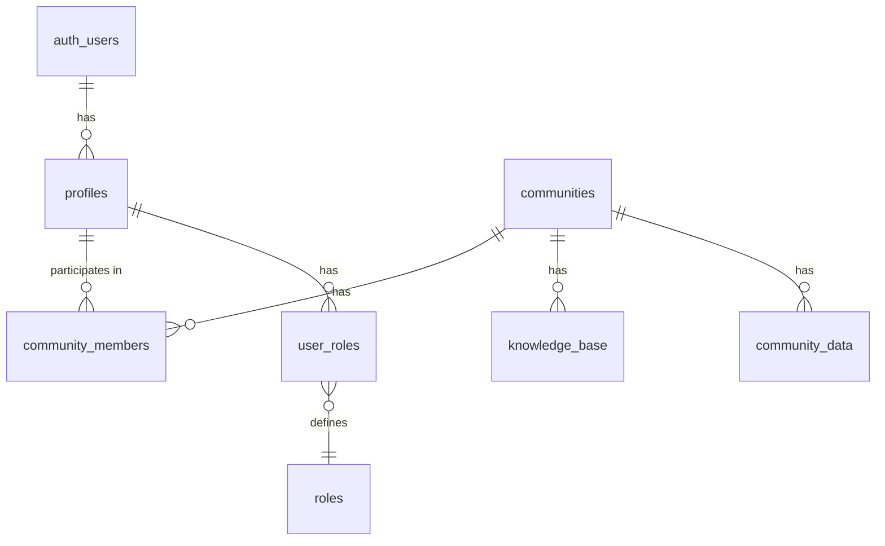

# ECO8 Platform Documentation

## Overview

ECO8 is a platform designed to help users create, manage, and participate in online communities. It offers features like community profiles, knowledge bases, member management, and administrative capabilities.

## Technology Stack

### Frontend
- **Framework**: React.js with TypeScript
- **Build Tool**: Vite
- **UI Library**: shadcn/ui components (built on Radix UI primitives)
- **Styling**: Tailwind CSS
- **State Management**: React Context API, TanStack React Query
- **Data Fetching**: TanStack React Query
- **Routing**: React Router DOM
- **Visualization**: D3.js, Recharts

### Backend
- **Database**: PostgreSQL (via Supabase)
- **Authentication**: Supabase Auth
- **API**: Supabase Client SDK
- **Storage**: Supabase Storage
- **Security**: Row-Level Security (RLS)

## Framework Architecture

### Component Structure
The application follows a component-based architecture with:
- Pages (top-level routes)
- Components (reusable UI elements)
- Layouts (page structures)
- Contexts (state management)
- Hooks (custom logic)
- Services (API interaction)
- Models (type definitions)

### Directory Structure
```
src/
├── components/         # Reusable UI components
│   ├── ui/             # shadcn/ui components
│   ├── auth/           # Authentication components
│   ├── admin/          # Admin-specific components
│   └── community/      # Community-related components
├── contexts/           # React contexts for state management
├── data/               # Mock data and data utilities
├── hooks/              # Custom React hooks
├── integrations/       # Third-party service integrations
│   └── supabase/       # Supabase client configuration
├── lib/                # Utility functions and helpers
├── models/             # TypeScript type definitions
├── pages/              # Page components for each route
│   ├── admin/          # Admin pages
│   └── knowledge/      # Knowledge base pages
├── services/           # Business logic and API services
└── utils/              # Helper functions
```

## Database Structure

The platform uses Supabase (PostgreSQL) with the following table structure:

### SQL Schema and Relationships

#### Table Structure



#### Auth Schema
This schema is managed by Supabase and contains essential authentication tables.

##### `auth.users`
Primary authentication table managed by Supabase:
- `id` (UUID, PK): User identifier
- `email` (text): User's email
- `encrypted_password` (text): Password hash
- `confirmed_at` (timestamp): Email confirmation time
- `confirmation_sent_at` (timestamp): Confirmation email sent time
- `recovery_sent_at` (timestamp): Recovery email sent time
- `raw_user_meta_data` (JSONB): Custom user metadata
- `created_at` (timestamp): Account creation time
- `updated_at` (timestamp): Last update time

#### Public Schema
Custom tables in the public schema to store application data.

##### `profiles`
Stores user profile information linked to auth.users:
```sql
CREATE TABLE public.profiles (
  id UUID PRIMARY KEY REFERENCES auth.users(id) ON DELETE CASCADE,
  first_name TEXT,
  last_name TEXT,
  email TEXT NOT NULL,
  avatar_url TEXT,
  created_at TIMESTAMPTZ NOT NULL DEFAULT timezone('utc', now()),
  updated_at TIMESTAMPTZ NOT NULL DEFAULT timezone('utc', now())
);

CREATE TRIGGER set_profiles_updated_at
BEFORE UPDATE ON public.profiles
FOR EACH ROW EXECUTE FUNCTION public.handle_updated_at();
```

##### `communities`
Stores community information:
```sql
CREATE TABLE public.communities (
  id UUID PRIMARY KEY DEFAULT extensions.uuid_generate_v4(),
  name TEXT NOT NULL,
  description TEXT,
  logo_url TEXT,
  website TEXT,
  created_at TIMESTAMPTZ NOT NULL DEFAULT timezone('utc', now()),
  updated_at TIMESTAMPTZ NOT NULL DEFAULT timezone('utc', now())
);

CREATE TRIGGER set_communities_updated_at
BEFORE UPDATE ON public.communities
FOR EACH ROW EXECUTE FUNCTION public.handle_updated_at();
```

##### `community_members`
Manages the relationship between users and communities:
```sql
CREATE TABLE public.community_members (
  id UUID PRIMARY KEY DEFAULT extensions.uuid_generate_v4(),
  community_id UUID NOT NULL REFERENCES public.communities(id) ON DELETE CASCADE,
  user_id UUID NOT NULL REFERENCES auth.users(id) ON DELETE CASCADE,
  role TEXT NOT NULL DEFAULT 'member',
  joined_at TIMESTAMPTZ NOT NULL DEFAULT timezone('utc', now()),
  UNIQUE(community_id, user_id)
);
```

##### `knowledge_base`
Stores knowledge base articles:
```sql
CREATE TABLE public.knowledge_base (
  id UUID PRIMARY KEY DEFAULT extensions.uuid_generate_v4(),
  community_id UUID NOT NULL REFERENCES public.communities(id) ON DELETE CASCADE,
  title TEXT NOT NULL,
  content TEXT NOT NULL,
  created_by UUID REFERENCES auth.users(id),
  created_at TIMESTAMPTZ NOT NULL DEFAULT timezone('utc', now()),
  updated_at TIMESTAMPTZ NOT NULL DEFAULT timezone('utc', now())
);

CREATE TRIGGER set_knowledge_base_updated_at
BEFORE UPDATE ON public.knowledge_base
FOR EACH ROW EXECUTE FUNCTION public.handle_updated_at();
```

##### `roles`
Defines system roles:
```sql
CREATE TABLE public.roles (
  id UUID PRIMARY KEY DEFAULT gen_random_uuid(),
  name TEXT NOT NULL,
  description TEXT,
  permissions JSONB,
  created_at TIMESTAMPTZ NOT NULL DEFAULT now()
);
```

##### `user_roles`
Manages the relationship between users and roles:
```sql
CREATE TABLE public.user_roles (
  id UUID PRIMARY KEY DEFAULT gen_random_uuid(),
  user_id UUID NOT NULL REFERENCES auth.users(id) ON DELETE CASCADE,
  role_id UUID NOT NULL REFERENCES public.roles(id),
  assigned_at TIMESTAMPTZ NOT NULL DEFAULT now(),
  assigned_by UUID,
  UNIQUE(user_id, role_id)
);
```

##### `community_data`
Stores additional data for communities:
```sql
CREATE TABLE public.community_data (
  id UUID PRIMARY KEY DEFAULT extensions.uuid_generate_v4(),
  community_id UUID NOT NULL REFERENCES public.communities(id) ON DELETE CASCADE,
  data_type TEXT NOT NULL,
  data JSONB NOT NULL,
  metadata JSONB,
  imported_at TIMESTAMPTZ NOT NULL DEFAULT timezone('utc', now()),
  imported_by UUID REFERENCES auth.users(id)
);
```

### Database Functions

#### `handle_updated_at()`
Updates the timestamp automatically when records are modified:

```sql
CREATE OR REPLACE FUNCTION public.handle_updated_at()
RETURNS TRIGGER AS $$
BEGIN
  NEW.updated_at = NOW();
  RETURN NEW;
END;
$$ LANGUAGE plpgsql;
```

#### `handle_new_user()`
Creates a profile automatically when a new user signs up:

```sql
CREATE OR REPLACE FUNCTION public.handle_new_user()
RETURNS TRIGGER AS $$
BEGIN
  INSERT INTO public.profiles (id, email, first_name, last_name)
  VALUES (
    NEW.id,
    NEW.email,
    NEW.raw_user_meta_data->>'first_name',
    NEW.raw_user_meta_data->>'last_name'
  );
  RETURN NEW;
END;
$$ LANGUAGE plpgsql SECURITY DEFINER;

-- Trigger to create profile on user signup
CREATE TRIGGER on_auth_user_created
  AFTER INSERT ON auth.users
  FOR EACH ROW EXECUTE FUNCTION public.handle_new_user();
```

#### `has_role()`
Checks if a user has a specific role:

```sql
CREATE OR REPLACE FUNCTION public.has_role(user_id uuid, role_name text)
RETURNS boolean
LANGUAGE sql
STABLE SECURITY DEFINER
SET search_path TO 'public'
AS $$
  SELECT EXISTS (
    SELECT 1
    FROM public.user_roles ur
    JOIN public.roles r ON ur.role_id = r.id
    WHERE ur.user_id = user_id
    AND r.name = role_name
  );
$$;
```

#### `get_user_roles()`
Returns all roles assigned to a user:

```sql
CREATE OR REPLACE FUNCTION public.get_user_roles(user_id uuid)
RETURNS SETOF text
LANGUAGE sql
STABLE SECURITY DEFINER
SET search_path TO 'public'
AS $$
  SELECT r.name
  FROM public.user_roles ur
  JOIN public.roles r ON ur.role_id = r.id
  WHERE ur.user_id = user_id;
$$;
```

#### `get_highest_role()`
Returns the highest role assigned to a user:

```sql
CREATE OR REPLACE FUNCTION public.get_highest_role(user_id uuid)
RETURNS text
LANGUAGE plpgsql
STABLE SECURITY DEFINER
SET search_path TO 'public'
AS $$
DECLARE
  highest_role TEXT;
BEGIN
  -- Check for admin role first
  IF public.has_role(user_id, 'ADMIN') THEN
    RETURN 'ADMIN';
  END IF;
  
  -- Check for organizer role next
  IF public.has_role(user_id, 'ORGANIZER') THEN
    RETURN 'ORGANIZER';
  END IF;
  
  -- Check for member role next
  IF public.has_role(user_id, 'MEMBER') THEN
    RETURN 'MEMBER';
  END IF;
  
  -- Default to GUEST
  RETURN 'GUEST';
END;
$$;
```

### Relationships

The database uses the following key relationships:

1. **User - Profile**: One-to-one relationship
   - `profiles.id` references `auth.users.id`
   - When an `auth.users` record is deleted, the associated `profiles` record is cascaded

2. **Profile - Community Membership**: One-to-many relationship
   - A profile can have multiple community memberships
   - `community_members.user_id` references `auth.users.id`

3. **Community - Community Membership**: One-to-many relationship
   - A community can have multiple members
   - `community_members.community_id` references `communities.id`

4. **Community - Knowledge Base**: One-to-many relationship
   - A community can have multiple knowledge base articles
   - `knowledge_base.community_id` references `communities.id`

5. **User - User Roles**: One-to-many relationship
   - A user can have multiple roles
   - `user_roles.user_id` references `auth.users.id`

6. **Roles - User Roles**: One-to-many relationship
   - A role can be assigned to multiple users
   - `user_roles.role_id` references `roles.id`

## User Role System

The platform implements a multi-level role system:

### Platform-Level Roles

The `UserRole` enum defines the primary roles in the system:

```typescript
export enum UserRole {
  ADMIN = "ADMIN",        // System administrators
  ORGANIZER = "ORGANIZER", // Community organizers
  MEMBER = "MEMBER",      // Regular community members
  GUEST = "GUEST"         // Unauthenticated/public users
}
```

These roles are managed through the `user_roles` and `roles` tables:

- **ADMIN**: Has full access to all features and communities
- **ORGANIZER**: Can manage specific communities they're assigned to
- **MEMBER**: Can participate in communities and access content
- **GUEST**: Limited to public areas of the platform

### Community-Level Roles

Within each community, users can have specific roles stored in the `community_members` table:

- **admin**: Can manage community settings, members, and content
- **member**: Can participate in community activities and access content

### Role Determination Logic

The application determines a user's effective role using the following logic:

1. If the user has an entry in `user_roles` linked to the 'ADMIN' role, they're a system admin
2. If the user is an admin for any community (`community_members` with `role = 'admin'`), they're an ORGANIZER
3. If the user has any community membership, they're a MEMBER
4. Otherwise, they're a GUEST

## Authentication System

The application uses Supabase Authentication with:
- Email/password authentication
- Role-based access control
- User profile management

### Authentication Flow

1. User signs up/logs in through the Auth page
2. Supabase validates credentials and returns a session
3. The session is managed by `useSession` hook
4. User profile is fetched via `useProfile` hook
5. Combined authentication state is provided by `useAuth` hook
6. `UserContext` makes auth state available throughout the app
7. Protected routes check permissions via `ProtectedRoute` component

## API Endpoints and Services

The application uses the Supabase JavaScript client for API access:

### User Management
- **Authentication**: Login, logout, session management
- **Profile**: Get user data, update profile
- **Roles**: Assign and manage user roles 

### Community Management
- **Communities**: Create, read, update communities
- **Membership**: Join, leave, manage community memberships
- **Roles**: Assign and manage community roles

### Knowledge Base
- **Articles**: Create, read, update, delete knowledge base articles
- **Access Control**: Manage article visibility and permissions

### Admin Functions
- **User Management**: Manage platform users
- **Community Oversight**: Monitor and manage communities
- **System Settings**: Configure platform settings

## Protected Routes

The application implements route protection based on user roles:

- `/profile`: Protected for authenticated users (MEMBER+)
- `/admin`: Protected for platform administrators (ORGANIZER+)
- `/admin/community/:id`: Protected for community administrators (ORGANIZER+)
- `/knowledge/:communityId`: Protected for community members (MEMBER+)

## Security

### Row-Level Security (RLS)

For security, the platform implements Row-Level Security policies to control access to database tables.

Example RLS policy for community membership:

```sql
-- Allow users to see only their own memberships
CREATE POLICY "Users can view their own memberships"
  ON public.community_members
  FOR SELECT
  USING (auth.uid() = user_id);

-- Allow community admins to view all memberships in their communities
CREATE POLICY "Community admins can view all memberships"
  ON public.community_members
  FOR SELECT
  USING (
    auth.uid() IN (
      SELECT user_id FROM public.community_members 
      WHERE community_id = community_members.community_id 
      AND role = 'admin'
    )
  );
```

## Development Guidelines

### Adding New Features
1. Define the feature requirements and user stories
2. Update TypeScript models if needed
3. Create or update database tables if required
4. Implement service methods for business logic
5. Build UI components and pages
6. Connect components to services through custom hooks
7. Test the feature end-to-end

### Authentication Best Practices
- Always use the ProtectedRoute component for restricted routes
- Check user roles and permissions before displaying sensitive UI
- Use the useUser hook to access the current user state
- Implement proper error handling for authentication failures

### Database Access Patterns
- Always use the service layer to access the database
- Keep database queries in the appropriate service files
- Implement proper error handling for database operations
- Use Row-Level Security for data protection
