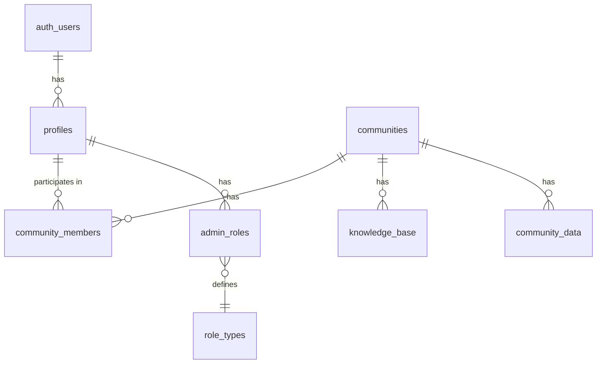

# ECO8 Platform Documentation

## Overview

ECO8 is a platform designed to help users create, manage, and participate in online communities. It offers features like community profiles, knowledge bases, member management, and administrative capabilities.

## Technology Stack

### Frontend
- **Framework**: React.js with TypeScript
- **Build Tool**: Vite
- **UI Library**: shadcn/ui components (built on Radix UI primitives)
- **Styling**: Tailwind CSS
- **State Management**: React Context API
- **Data Fetching**: TanStack React Query (formerly React Query)
- **Routing**: React Router DOM

### Backend
- **Database**: PostgreSQL (via Supabase)
- **Authentication**: Supabase Auth
- **API**: Supabase Client SDK

## Framework Architecture

### Component Structure
The application follows a component-based architecture with:
- Pages (top-level routes)
- Components (reusable UI elements)
- Layouts (page structures)
- Contexts (state management)
- Hooks (custom logic)
- Services (API interaction)
- Repositories (data access)
- Models (type definitions)

### Directory Structure
```
src/
├── components/         # Reusable UI components
│   ├── ui/             # shadcn/ui components
│   ├── auth/           # Authentication components
│   ├── admin/          # Admin-specific components
│   └── community/      # Community-related components
├── contexts/           # React contexts for state management
├── data/               # Mock data and data utilities
├── hooks/              # Custom React hooks
├── integrations/       # Third-party service integrations
│   └── supabase/       # Supabase client configuration
├── lib/                # Utility functions and helpers
├── models/             # TypeScript type definitions
├── pages/              # Page components for each route
│   ├── admin/          # Admin pages
│   └── knowledge/      # Knowledge base pages
├── repositories/       # Data access layer
│   └── community/      # Community-specific data access
└── services/           # Business logic and API services
```

## Database Structure

The platform uses Supabase (PostgreSQL) with the following table structure:

### SQL Schema and Relationships

#### Table Structure Diagrams



## Community System Architecture

### Database Tables for Communities

#### `communities` Table
Primary table for storing community information:
- `id` (UUID, PK): Unique identifier
- `name` (text): Community name
- `description` (text): Community description
- `logo_url` (text): Community logo image URL
- `website` (text): Community website URL
- `is_public` (boolean): Whether the community is publicly visible
- `location` (text): Physical or virtual location
- `member_count` (text): Current member count (stored as text)
- `owner_id` (UUID): References the creator's profile ID
- `target_audience` (text[]): Array of target audience tags
- `type` (text): Community type (e.g., "tech", "creative")
- `format` (text): Community format (e.g., "online", "IRL", "hybrid")
- `social_media` (JSONB): Social media handles and links
- `communication_platforms` (JSONB): Communication platform settings
- `newsletter_url` (text): Newsletter subscription URL
- `created_at` (timestamptz): Creation timestamp
- `updated_at` (timestamptz): Last update timestamp

#### `community_data_distribution` Table
Manages the community creation workflow:
- `id` (UUID, PK): Unique identifier
- `submission_data` (JSONB): Form data from community creation
- `submitter_id` (UUID): User ID who submitted the form
- `status` (text): Workflow status ('pending', 'processing', 'completed', 'failed')
- `community_id` (UUID): ID of created community (once completed)
- `processed_at` (timestamptz): When the submission was processed
- `error_message` (text): Error message if submission failed
- `created_at` (timestamptz): Submission timestamp

#### `community_data` Table
Stores additional community data:
- `id` (UUID, PK): Unique identifier
- `community_id` (UUID, FK): References communities.id
- `data_type` (text): Type of data stored
- `data` (JSONB): The actual data content
- `metadata` (JSONB): Additional metadata
- `imported_at` (timestamptz): When the data was imported
- `imported_by` (UUID): User who imported the data

### Community Files & Component Structure

#### Core Community Components

1. **Community Header (`CommunityHeader.tsx`)**
   - Displays the community banner, name, tagline, and key metrics
   - Shows location, member count, tags, and primary action buttons
   - Integrates with `PlexusBackground.tsx` for visual effects

2. **Community Card Preview (`CommunityCardPreview.tsx`)**
   - Renders a preview of how a community will appear in listings
   - Shows name, description, location, size, format, and tags
   - Used in the community creation flow

3. **Community Meta Info (`CommunityMetaInfo.tsx`)**
   - Displays detailed community metadata in an organized layout
   - Includes founder, type, location, creation date, size, and format
   - Shows target audience and social media links

#### Community Form Components

1. **Unified Community Form (`UnifiedCommunityForm.tsx`)**
   - Master form component with two modes: 'setup' and 'edit'
   - Setup mode uses a step-based wizard interface
   - Edit mode uses a tabbed interface for easier navigation
   - Steps include:
     - Basic Details
     - Location & Format
     - Online Presence
     - Additional Details

2. **Form Steps Components**
   - `BasicDetailsStep.tsx`: Name, description, type
   - `LocationFormatStep.tsx`: Location, format, target audience
   - `OnlinePresenceStep.tsx`: Website, social media
   - `AdditionalDetailsStep.tsx`: Founding date, event frequency

3. **Review & Submit (`ReviewSubmitStep.tsx`)**
   - Final step in community creation workflow
   - Shows preview of community card
   - Handles submission and status tracking
   - Provides feedback during processing

#### Repositories & Services

1. **Community Query Repository (`communityQueryRepository.ts`)**
   - Exports query functions from individual files:
     - `getAllCommunities.ts`: Fetches paginated communities
     - `getCommunityById.ts`: Gets a single community by ID
     - `searchCommunities.ts`: Searches communities by text
     - `getManagedCommunities.ts`: Gets user-managed communities

2. **Community Mutation Repository (`communityMutationRepository.ts`)**
   - `updateCommunity`: Updates existing community
   - `createCommunity`: Creates a new community
   - `deleteCommunity`: Safely deletes a community

3. **Community Services**
   - `communitySubmissionService.ts`: Handles form validation and submission
   - `communityDistributionService.ts`: Processes submissions via distribution system
   - `communityMutationService.ts`: Direct CRUD operations
   - `communityQueryService.ts`: Query operations with logging

### Community Hooks

1. **Creation Hooks**
   - `useCreateCommunityForm.ts`: Manages form state and submission
   - `useSubmitCommunityStatus.ts`: Tracks submission status

2. **Query Hooks**
   - `useCommunityForm.ts`: Form context provider
   - `useSubmitCommunity.ts`: Handles community submission

### User Flow and Experience

#### Community Creation Flow

1. **User Journey**:
   - User navigates to "Create Community" page
   - Multi-step form guides through community setup:
     1. Basic information (name, description, type)
     2. Location, format, and audience targeting
     3. Online presence (website, social media)
     4. Additional details (founding date, event frequency)
   - Preview card shows how community will appear
   - Submission triggers workflow in `community_data_distribution`
   - User receives confirmation and is redirected to new community

2. **Error Handling**:
   - Form validation occurs at each step
   - Submission errors are tracked and displayed
   - Distribution errors are logged for admin review

#### Community Viewing Experience

1. **Community Card**:
   - Consistent card design across the platform
   - Shows name, description, location, size, format, tags
   - Visual indicators for active/recent communities
   - Action buttons for joining or learning more

2. **Community Profile Page**:
   - Hero section with community banner
   - Metadata section with key information
   - Tabs for different sections (about, members, content)
   - Action buttons for engagement (connect, follow)

3. **Community Management**:
   - Tab-based interface for owners to edit settings
   - Metrics dashboard for tracking growth
   - Member management tools

### UI Components for Communities

1. **Cards and Lists**:
   - `CommunityCard.tsx`: Standard card for community listings
   - `CommunityList.tsx`: Container for multiple community cards
   - `CommunityCardPreview.tsx`: Preview during creation

2. **Visual Elements**:
   - `PlexusBackground.tsx`: Dynamic background for community headers
   - `Badge.tsx`: Used for tags, types, and formats
   - `SocialMediaLinks.tsx`: Icons for social media platforms

3. **Form Components**:
   - `Steps.tsx`: Progress indicator for multi-step forms
   - `Tabs.tsx`: Navigation for form sections
   - Various input components (text, select, tags)

4. **Interactive Elements**:
   - Connect/Join buttons
   - Follow/Bookmark toggles
   - Share functionality

## User Role System

The platform implements a multi-level role system:

### Platform-Level Roles

The `UserRole` enum defines the primary roles in the system:

```typescript
export enum UserRole {
  ADMIN = "ADMIN",        // System administrators
  ORGANIZER = "ORGANIZER", // Community organizers
  MEMBER = "MEMBER",      // Regular community members
  GUEST = "GUEST"         // Unauthenticated/public users
}
```

These roles are stored in the `admin_roles` table and managed through the `adminService`:

- **ADMIN**: Has full access to all features and communities
- **ORGANIZER**: Can manage specific communities they're assigned to
- **MEMBER**: Can participate in communities and access content
- **GUEST**: Limited to public areas of the platform

### Community-Level Roles

Within each community, users can have specific roles stored in the `community_members` table:

- **admin**: Can manage community settings, members, and content
- **member**: Can participate in community activities and access content

### Role Determination Logic

The application determines a user's effective role using the following logic:

1. If the user has an entry in `admin_roles` with `role = 'ADMIN'`, they're a system admin
2. If the user is an admin for any community (`community_members` with `role = 'admin'`), they're an ORGANIZER
3. If the user has any community membership, they're a MEMBER
4. Otherwise, they're a GUEST

This is implemented in the `useProfile` hook:

```typescript
// Role determination logic (simplified)
const role = adminRole?.role === "ADMIN" ? UserRole.ADMIN : 
            (managedCommunities.length > 0 ? UserRole.ORGANIZER : UserRole.MEMBER);
```

### Permission System

The platform uses the `usePermissions` hook to handle permission checks:

- `hasPermission(resource, action)`: Checks if a user can perform an action on a resource
- `isOrganizer(communityId)`: Checks if a user is an organizer for a specific community

The `ProtectedRoute` component ensures users have the required role to access certain areas:

```typescript
const hasRequiredRole = 
  currentUser.role === UserRole.ADMIN || // Admins can access everything
  currentUser.role === roleEnum ||
  (roleEnum === UserRole.ORGANIZER && 
   communityId && 
   currentUser.managedCommunities?.includes(communityId));
```

## Authentication System

The application uses Supabase Authentication with:
- Email/password authentication
- Role-based access control
- User profile management

### Authentication Flow

1. User signs up/logs in through the Auth page
2. Supabase validates credentials and returns a session
3. The session is managed by `useSession` hook
4. User profile is fetched via `useProfile` hook
5. Combined authentication state is provided by `useAuth` hook
6. `UserContext` makes auth state available throughout the app
7. Protected routes check permissions via `ProtectedRoute` component

## API Endpoints and Services

The application uses the Supabase JavaScript client for API access:

### User Management
- **Authentication**: Login, logout, session management
- **Profile**: Get user data, update profile

### Community Management
- **Communities**: Create, read, update communities
- **Membership**: Join, leave, manage community memberships
- **Roles**: Assign and manage community roles

### Knowledge Base
- **Articles**: Create, read, update, delete knowledge base articles
- **Access Control**: Manage article visibility and permissions

### Admin Functions
- **User Management**: Manage platform users
- **Community Oversight**: Monitor and manage communities
- **System Settings**: Configure platform settings

## Protected Routes

The application implements route protection based on user roles:

- `/profile`: Protected for authenticated users (MEMBER+)
- `/admin`: Protected for platform administrators (ORGANIZER+)
- `/admin/community/:id`: Protected for community administrators (ORGANIZER+)
- `/knowledge/:communityId`: Protected for community members (MEMBER+)

## Client-side Services

### User Service
- `getUserById`: Fetch user details
- `getCommunityOrganizers`: Get community admins
- `getCommunityMembers`: Get community members

### Community Service
- `getAllCommunities`: List all communities
- `getCommunityById`: Get community details
- `searchCommunities`: Search communities
- `getManagedCommunities`: Get communities managed by a user
- `updateCommunity`: Update community details
- `createCommunity`: Create a new community
- `joinCommunity`: Join a community
- `leaveCommunity`: Leave a community
- `makeAdmin`: Promote a user to community admin
- `removeAdmin`: Remove admin privileges

### Admin Service
- `createAdminAccount`: Create a new admin user account

## Data Flow

1. **Authentication Flow**:
   - User logs in through the Auth page
   - Supabase validates credentials and returns a session
   - UserContext stores the current user state
   - Protected routes check permissions via ProtectedRoute component

2. **Community Access Flow**:
   - Communities are fetched from the database
   - User permissions are checked against community membership
   - UI adapts based on user role and permissions

3. **Data Mutation Flow**:
   - User actions trigger service functions
   - Services call repository methods
   - Repositories interact with Supabase
   - UI updates based on React Query cache updates

## Development Guidelines

### Adding New Features
1. Define the feature requirements and user stories
2. Update TypeScript models if needed
3. Create or update database tables if required
4. Implement repository methods for data access
5. Create service methods for business logic
6. Build UI components and pages
7. Connect components to services
8. Test the feature end-to-end

### Authentication Best Practices
- Always use the ProtectedRoute component for restricted routes
- Check user roles and permissions before displaying sensitive UI
- Use the useUser hook to access the current user state
- Implement proper error handling for authentication failures

### Database Access Patterns
- Always use the repository layer to access the database
- Keep database queries in the repository files
- Use service layer to combine multiple repository calls
- Implement proper error handling for database operations

### UI Component Guidelines
- Follow the Tailwind CSS and shadcn/ui design system
- Create small, reusable components
- Use TypeScript for type safety
- Implement responsive design for all components

## Deployment

The application can be deployed using:
- Netlify for the frontend
- Supabase for backend services and database

## Appendix

### TypeScript Models

Key type definitions include:

```typescript
export enum UserRole {
  ADMIN = "ADMIN",        // System administrators
  ORGANIZER = "ORGANIZER", // Community organizers
  MEMBER = "MEMBER",      // Regular community members
  GUEST = "GUEST"         // Unauthenticated/public users
}

export interface User {
  id: string;
  name: string;
  role: UserRole;
  imageUrl: string;
  email: string;
  bio: string;
  communities: string[];
  managedCommunities?: string[];
}

export interface Community {
  id: string;
  name: string;
  description: string;
  owner_id?: string;
  type?: string;
  format?: string;
  location?: string;
  target_audience?: string[];
  social_media?: Record<string, string | { url?: string }>;
  website?: string;
  created_at: string;
  updated_at: string;
  member_count?: string;
  is_public: boolean;
  newsletter_url?: string;
  logo_url?: string;
  founder_name?: string;
  communitySize: string; // For backward compatibility
  organizerIds: string[];
  memberIds: string[];
  tags: string[];
  // Added aliases for backward compatibility
  imageUrl?: string; // Alias for logo_url
  isPublic?: boolean; // Alias for is_public
  createdAt?: string; // Alias for created_at
  updatedAt?: string; // Alias for updated_at
  targetAudience?: string[]; // Alias for target_audience
  socialMedia?: Record<string, string | { url?: string }>; // Alias for social_media
  newsletterUrl?: string; // Alias for newsletter_url
}
```

### Row-Level Security (RLS)

For security, the platform implements Row-Level Security policies to control access to database tables:

```sql
-- Example RLS policy for community access
ALTER TABLE public.communities ENABLE ROW LEVEL SECURITY;

-- Allow users to see public communities
CREATE POLICY "Users can view public communities"
  ON public.communities
  FOR SELECT
  USING (is_public = true);

-- Allow owners to manage their communities
CREATE POLICY "Owners can manage their communities"
  ON public.communities
  USING (owner_id = auth.uid());

-- Allow admins to access all communities
CREATE POLICY "Admins can access all communities"
  ON public.communities
  USING (
    EXISTS (
      SELECT 1 FROM public.admin_roles 
      WHERE user_id = auth.uid() AND role = 'ADMIN'
    )
  );
```

### Community Creation Workflow

The platform implements a two-phase community creation process:

1. **Submission Phase**:
   - User submits community form data via `submitCommunity()`
   - Data is validated and stored in `community_data_distribution`
   - Function returns a distribution record with status

2. **Processing Phase**:
   - Database trigger or edge function processes the submission
   - Creates the community record in `communities` table
   - Updates distribution record with status and community ID
   - Client polls for status using `checkCommunitySubmission()`

3. **Completion Phase**:
   - Once status is 'completed', client navigates to new community
   - If status is 'failed', error is displayed to user

This workflow provides:
- Asynchronous processing of community creation
- Error handling and logging
- Ability to implement approval workflows
- Scalability for high-volume applications

### UI/UX Design System

The platform uses a consistent design system for community UI elements:

1. **Color Scheme**:
   - Primary: For main actions and branding
   - Accent (Aquamarine): For high-emphasis buttons and callouts
   - Muted: For backgrounds and secondary elements
   - Foreground: For text and icons

2. **Component Styling**:
   - Cards: Rounded corners, subtle shadows, border
   - Buttons: Consistent padding, hover effects
   - Typography: Hierarchical heading sizes, readable body text

3. **Layout Patterns**:
   - Grid system for card layouts
   - Flexbox for component alignment
   - Container constraints for readability

4. **Animation & Transitions**:
   - Subtle hover effects
   - Loading states with spinners or skeletons
   - Smooth page transitions

5. **Responsive Design**:
   - Mobile-first approach
   - Breakpoints for different device sizes
   - Layout adjustments for small screens

### Design Tokens

```css
/* Example design tokens */
:root {
  --radius: 0.5rem;
  --font-sans: "Inter", sans-serif;
  
  --background: 0 0% 100%;
  --foreground: 240 10% 3.9%;
  --card: 0 0% 100%;
  --card-foreground: 240 10% 3.9%;
  --popover: 0 0% 100%;
  --popover-foreground: 240 10% 3.9%;
  --primary: 240 5.9% 10%;
  --primary-foreground: 0 0% 98%;
  --secondary: 240 4.8% 95.9%;
  --secondary-foreground: 240 5.9% 10%;
  --muted: 240 4.8% 95.9%;
  --muted-foreground: 240 3.8% 46.1%;
  --accent: 160 84% 39%;
  --accent-foreground: 0 0% 98%;
  --destructive: 0 84.2% 60.2%;
  --destructive-foreground: 0 0% 98%;
  --border: 240 5.9% 90%;
  --input: 240 5.9% 90%;
  --ring: 240 5.9% 10%;
}

.dark {
  --background: 240 10% 3.9%;
  --foreground: 0 0% 98%;
  --card: 240 10% 3.9%;
  --card-foreground: 0 0% 98%;
  --popover: 240 10% 3.9%;
  --popover-foreground: 0 0% 98%;
  --primary: 0 0% 98%;
  --primary-foreground: 240 5.9% 10%;
  --secondary: 240 3.7% 15.9%;
  --secondary-foreground: 0 0% 98%;
  --muted: 240 3.7% 15.9%;
  --muted-foreground: 240 5% 64.9%;
  --accent: 160 84% 39%;
  --accent-foreground: 240 5.9% 10%;
  --destructive: 0 62.8% 30.6%;
  --destructive-foreground: 0 0% 98%;
  --border: 240 3.7% 15.9%;
  --input: 240 3.7% 15.9%;
  --ring: 240 4.9% 83.9%;
}
```
