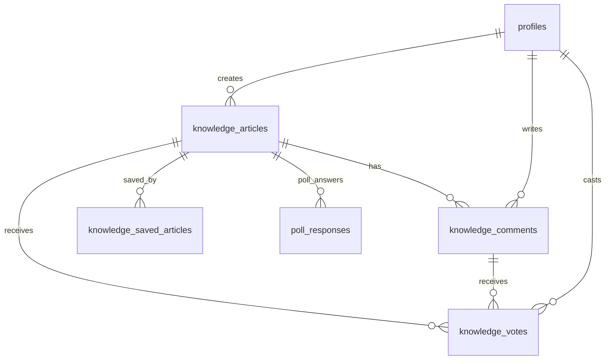
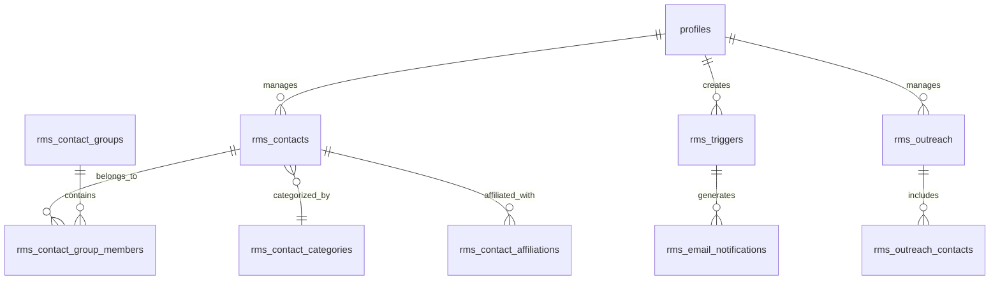
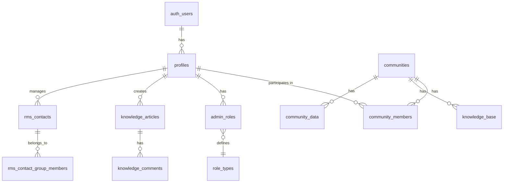

# ECO8 Platform Documentation

## Overview

ECO8 is a platform designed to help users create, manage, and participate in online communities. It offers features like community profiles, knowledge bases, member management, and administrative capabilities.

## Technology Stack

### Frontend
- **Framework**: React.js with TypeScript
- **Build Tool**: Vite
- **UI Library**: shadcn/ui components (built on Radix UI primitives)
- **Styling**: Tailwind CSS
- **State Management**: React Context API
- **Data Fetching**: TanStack React Query (formerly React Query)
- **Routing**: React Router DOM

### Backend
- **Database**: PostgreSQL (via Supabase)
- **Authentication**: Supabase Auth
- **API**: Supabase Client SDK

## Framework Architecture

### Component Structure
The application follows a component-based architecture with:
- Pages (top-level routes)
- Components (reusable UI elements)
- Layouts (page structures)
- Contexts (state management)
- Hooks (custom logic)
- Services (API interaction)
- Repositories (data access)
- Models (type definitions)

### Directory Structure
```
src/
├── components/         # Reusable UI components
│   ├── ui/             # shadcn/ui components
│   ├── auth/           # Authentication components
│   ├── admin/          # Admin-specific components
│   ├── community/      # Community-related components
│   ├── knowledge/      # Knowledge base components
│   └── rel8t/          # Rel8 CRM components
├── contexts/           # React contexts for state management
├── data/               # Mock data and data utilities
├── hooks/              # Custom React hooks
├── integrations/       # Third-party service integrations
│   └── supabase/       # Supabase client configuration
├── lib/                # Utility functions and helpers
├── models/             # TypeScript type definitions
├── pages/              # Page components for each route
│   ├── admin/          # Admin pages
│   ├── knowledge/      # Knowledge base pages
│   └── rel8t/          # Rel8 CRM pages
├── repositories/       # Data access layer
│   └── community/      # Community-specific data access
└── services/           # Business logic and API services
```

## Knowledge Base System - Technical UX/UI Documentation

### Overview
The Knowledge Base system is a comprehensive content management and collaboration platform that enables users to create, share, and discover knowledge through various content types including articles, questions, quotes, and polls.

### User Experience Design Philosophy

#### Core UX Principles
1. **Content-First Design**: Interface prioritizes readability and content consumption
2. **Progressive Disclosure**: Complex features revealed based on user context and permissions
3. **Collaborative Learning**: Social features encourage knowledge sharing and community building
4. **Accessible Knowledge**: Multiple content types cater to different learning preferences
5. **Contextual Actions**: Tools and options appear when relevant to user's current task

#### Information Architecture
```
Knowledge Base
├── Content Discovery
│   ├── Browse All Articles
│   ├── Search & Filters
│   ├── Tag-based Navigation
│   └── Related Content
├── Content Creation
│   ├── Article Writing
│   ├── Question Asking
│   ├── Quote Sharing
│   └── Poll Creation
├── Content Interaction
│   ├── Voting System
│   ├── Comment System
│   ├── Bookmarking
│   └── Sharing
└── Content Management
    ├── User Resources
    ├── Analytics
    └── Moderation
```

### Database Architecture for Knowledge Base

#### Core Tables

**knowledge_articles**
- Primary content storage table
- Supports multiple content types (ARTICLE, QUESTION, QUOTE, POLL)
- Fields: id, user_id, title, subtitle, content, content_type, tags, vote_count, view_count, comment_count, is_answered, poll_data, options, source, created_at, updated_at

**knowledge_comments**
- Threaded comment system
- Support for accepted answers on questions
- Fields: id, article_id, user_id, content, is_accepted, created_at, updated_at

**knowledge_votes**
- Unified voting system for articles and comments
- Supports upvote/downvote mechanics
- Fields: id, user_id, article_id, comment_id, vote_type, created_at

**knowledge_saved_articles**
- User bookmarking system
- Personal knowledge library
- Fields: id, user_id, article_id, saved_at

**knowledge_tags**
- Tag management and categorization
- Enables content discovery
- Fields: id, name, description, created_at

**poll_responses & poll_votes**
- Dedicated poll interaction tracking
- Support for multiple choice and single choice polls
- Fields: id, poll_id, user_id, option_index, created_at

#### Database Relationships


### App Routes for Knowledge Base

#### Public Routes
- `/knowledge` - Main knowledge base landing page with content discovery
- `/knowledge/:id` - Individual article/content view with full interaction
- `/knowledge/tags/:tag` - Tag-filtered content browsing

#### Protected Routes (Authenticated Users)
- `/knowledge/create` - Content type selection interface
- `/knowledge/wizard` - Step-by-step content creation wizard
- `/knowledge/resources` - User's personal knowledge dashboard
- `/knowledge/topics` - Topic exploration and management
- `/knowledge/:id/edit` - Content editing interface

#### Route Structure Analysis
```typescript
// Route hierarchy and user flow
/knowledge
├── / (discovery & browsing)
├── /create (content type selection)
├── /wizard (guided content creation)
├── /resources (personal dashboard)
├── /topics (topic management)
├── /:id (content view)
├── /:id/edit (content editing)
└── /tags/:tag (tag-filtered browsing)
```

### UI Component Architecture

#### Page-Level Components

**KnowledgeBase.tsx** - Main landing page
- Content discovery interface
- Search and filtering capabilities
- Content type toggles
- Recent activity feed

**ArticleView.tsx** - Individual content display
- Responsive content rendering based on type
- Voting and interaction components
- Comment threading system
- Related content suggestions

**PostWizard.tsx** - Content creation flow
- Multi-step form interface
- Content type specific forms
- Preview and review stages
- Submission handling

**PostTypeSelector.tsx** - Content type selection
- Visual content type picker
- Feature comparison matrix
- Quick creation shortcuts

#### Reusable UI Components

**Content Display Components**
- `ArticleCard.tsx` - Content preview cards with metadata
- `VotingButtons.tsx` - Unified voting interface with animations
- `CommentSection.tsx` - Threaded comment display and creation
- `AuthorCard.tsx` - User information display with context
- `TagsList.tsx` - Interactive tag display and navigation

**Form Components**
- `ArticleForm.tsx` - Rich text article creation
- `QuestionForm.tsx` - Question-specific form with tagging
- `QuoteForm.tsx` - Streamlined quote sharing interface
- `PollForm.tsx` - Multi-option poll creation with preview

**Interactive Components**
- `PollVoting.tsx` - Real-time poll interaction with results
- `RelatedArticles.tsx` - Context-aware content suggestions
- `ContentTypeSelector.tsx` - Visual content type picker

### UX/UI Design Patterns

#### Content Type Differentiation
```css
/* Visual hierarchy for different content types */
.content-article { @apply border-l-4 border-blue-500; }
.content-question { @apply border-l-4 border-yellow-500; }
.content-quote { @apply border-l-4 border-purple-500; }
.content-poll { @apply border-l-4 border-green-500; }
```

#### Responsive Design Strategy
1. **Mobile-First Approach**: Core content consumption optimized for mobile
2. **Progressive Enhancement**: Desktop features like sidebar content
3. **Touch-Friendly Interactions**: Large tap targets for voting and actions
4. **Readable Typography**: Optimized line heights and spacing for long-form content

#### Accessibility Features
- Semantic HTML structure for screen readers
- Keyboard navigation support throughout
- High contrast color schemes
- Alternative text for visual content
- Focus management for modal interactions

## Rel8 CRM System - Technical UX/UI Documentation

### Overview
Rel8 is a comprehensive relationship management system designed for organizers to manage contacts, track relationships, automate outreach, and build meaningful connections within their communities.

### User Experience Design Philosophy

#### Core UX Principles
1. **Relationship-Centric Design**: Every feature supports building and maintaining relationships
2. **Automation with Human Touch**: Technology enhances but doesn't replace personal connection
3. **Context-Aware Interactions**: Information and actions relevant to current relationship state
4. **Scalable Personal Touch**: Systems that work for both small and large contact bases
5. **Data-Driven Insights**: Analytics help improve relationship building strategies

#### Information Architecture
```
Rel8 CRM
├── Contact Management
│   ├── Contact Database
│   ├── Contact Profiles
│   ├── Contact Groups
│   └── Contact Categories
├── Relationship Tracking
│   ├── Interaction History
│   ├── Relationship Mapping
│   ├── Connection Strength
│   └── Follow-up Reminders
├── Automation & Triggers
│   ├── Time-based Triggers
│   ├── Event-based Triggers
│   ├── Email Templates
│   └── Notification System
├── Analytics & Insights
│   ├── Contact Growth
│   ├── Engagement Metrics
│   ├── Outreach Effectiveness
│   └── Relationship Health
└── Communication Tools
    ├── Email Integration
    ├── Outreach Campaigns
    ├── Message Templates
    └── Response Tracking
```

### Database Architecture for Rel8 CRM

#### Core Tables

**rms_contacts**
- Central contact information storage
- Comprehensive contact profiles with metadata
- Fields: id, user_id, name, email, phone, organization, role, location, notes, tags, category_id, last_contact_date, created_at, updated_at

**rms_contact_groups**
- Flexible contact organization system
- Support for overlapping group memberships
- Fields: id, user_id, name, description, color, created_at, updated_at

**rms_contact_group_members**
- Many-to-many relationship between contacts and groups
- Enables complex contact segmentation
- Fields: id, group_id, contact_id, added_at

**rms_contact_categories**
- Hierarchical contact classification
- Visual organization with color coding
- Fields: id, user_id, name, color, created_at, updated_at

**rms_contact_affiliations**
- Complex relationship mapping between contacts
- Support for multiple affiliation types
- Fields: id, user_id, contact_id, affiliation_type, affiliated_contact_id, affiliated_user_id, affiliated_community_id, relationship, created_at, updated_at

**rms_triggers**
- Automation engine for relationship management
- Time-based and event-based trigger support
- Fields: id, user_id, name, description, condition, action, recurrence_pattern, execution_time, next_execution, last_executed_at, is_active, created_at, updated_at

**rms_email_notifications**
- Email automation and tracking
- Integration with trigger system
- Fields: id, user_id, trigger_id, recipient_email, recipient_name, subject, body, status, scheduled_for, sent_at, created_at, updated_at

**rms_outreach**
- Campaign and outreach management
- Priority and status tracking
- Fields: id, user_id, title, description, status, priority, due_date, created_at, updated_at

#### Database Relationships


### App Routes for Rel8 CRM

#### Protected Routes (Organizers Only)
- `/rel8` - Main dashboard with metrics and overview
- `/rel8/contacts` - Contact database and management
- `/rel8/contacts/new` - New contact creation form
- `/rel8/contacts/:id/edit` - Contact editing interface
- `/rel8/contacts/import` - Bulk contact import system
- `/rel8/groups` - Contact group management
- `/rel8/categories` - Contact category administration
- `/rel8/relationships` - Relationship mapping interface
- `/rel8/wizard` - Relationship creation wizard
- `/rel8/triggers` - Automation trigger management
- `/rel8/triggers/wizard` - Trigger creation wizard
- `/rel8/notifications` - Email notification center
- `/rel8/email-test` - Email system testing interface

#### Route Structure Analysis
```typescript
// Route hierarchy optimized for workflow efficiency
/rel8
├── / (dashboard overview)
├── /contacts (contact management hub)
│   ├── /new (streamlined contact creation)
│   ├── /:id/edit (comprehensive contact editing)
│   └── /import (bulk operations)
├── /groups (contact organization)
├── /categories (contact classification)
├── /relationships (relationship mapping)
├── /wizard (guided relationship creation)
├── /triggers (automation center)
│   └── /wizard (automation setup)
├── /notifications (communication hub)
└── /email-test (system validation)
```

### UI Component Architecture

#### Page-Level Components

**Dashboard.tsx** - Analytics and overview
- Key metrics display with charts
- Recent activity timeline
- Quick action buttons
- Contact growth visualization

**Contacts.tsx** - Contact database interface
- Searchable and filterable contact list
- Bulk operations support
- Quick preview and actions
- Export and import capabilities

**ContactCreate.tsx & ContactEdit.tsx** - Contact management
- Comprehensive contact forms
- Real-time validation
- Photo upload support
- Relationship mapping

**Groups.tsx** - Contact organization
- Visual group management
- Drag-and-drop contact assignment
- Group analytics and insights
- Color-coded organization

#### Specialized UI Components

**Contact Management Components**
- `ContactCard.tsx` - Contact preview with key information
- `ContactForm.tsx` - Comprehensive contact editing interface
- `ContactList.tsx` - Efficient list view with search and filters
- `ContactGroupsManager.tsx` - Group assignment and management

**Automation Components**
- `TriggerManagement.tsx` - Trigger overview and control panel
- `TriggerWizard.tsx` - Step-by-step automation setup
- `EmailNotificationsList.tsx` - Email queue and status tracking
- `TriggerStatsCards.tsx` - Automation effectiveness metrics

**Analytics Components**
- `MetricCard.tsx` - Key performance indicator display
- `StatisticsChart.tsx` - Visual data representation
- `ContactGrowthChart.tsx` - Contact acquisition tracking
- `DistributionChart.tsx` - Contact distribution analysis

### UX/UI Design Patterns

#### Relationship-Centric Design
```typescript
// Visual indicators for relationship strength
const RelationshipStrength = {
  strong: "border-green-500 bg-green-50",
  moderate: "border-yellow-500 bg-yellow-50", 
  weak: "border-red-500 bg-red-50",
  unknown: "border-gray-500 bg-gray-50"
};
```

#### Automation UX Patterns
1. **Progressive Disclosure**: Basic triggers first, advanced options on demand
2. **Visual Feedback**: Clear status indicators for automated processes
3. **Safety Mechanisms**: Confirmation dialogs for destructive actions
4. **Template System**: Pre-built templates for common automation scenarios

#### Data Visualization
- Clean, minimal charts focused on actionable insights
- Color-coded categories for quick visual scanning
- Responsive charts that work on mobile devices
- Interactive elements for drill-down analysis

## Database Structure

The platform uses Supabase (PostgreSQL) with the following table structure:

### SQL Schema and Relationships

#### Table Structure Diagrams



## Community System Architecture

### Database Tables for Communities

#### `communities` Table
Primary table for storing community information:
- `id` (UUID, PK): Unique identifier
- `name` (text): Community name
- `description` (text): Community description
- `logo_url` (text): Community logo image URL
- `website` (text): Community website URL
- `is_public` (boolean): Whether the community is publicly visible
- `location` (text): Physical or virtual location
- `member_count` (text): Current member count (stored as text)
- `owner_id` (UUID): References the creator's profile ID
- `target_audience` (text[]): Array of target audience tags
- `type` (text): Community type (e.g., "tech", "creative")
- `format` (text): Community format (e.g., "online", "IRL", "hybrid")
- `social_media` (JSONB): Social media handles and links
- `communication_platforms` (JSONB): Communication platform settings
- `newsletter_url` (text): Newsletter subscription URL
- `created_at` (timestamptz): Creation timestamp
- `updated_at` (timestamptz): Last update timestamp

#### `community_data_distribution` Table
Manages the community creation workflow:
- `id` (UUID, PK): Unique identifier
- `submission_data` (JSONB): Form data from community creation
- `submitter_id` (UUID): User ID who submitted the form
- `status` (text): Workflow status ('pending', 'processing', 'completed', 'failed')
- `community_id` (UUID): ID of created community (once completed)
- `processed_at` (timestamptz): When the submission was processed
- `error_message` (text): Error message if submission failed
- `created_at` (timestamptz): Submission timestamp

#### `community_data` Table
Stores additional community data:
- `id` (UUID, PK): Unique identifier
- `community_id` (UUID, FK): References communities.id
- `data_type` (text): Type of data stored
- `data` (JSONB): The actual data content
- `metadata` (JSONB): Additional metadata
- `imported_at` (timestamptz): When the data was imported
- `imported_by` (UUID): User who imported the data

### Community Files & Component Structure

#### Core Community Components

1. **Community Header (`CommunityHeader.tsx`)**
   - Displays the community banner, name, tagline, and key metrics
   - Shows location, member count, tags, and primary action buttons
   - Integrates with `PlexusBackground.tsx` for visual effects

2. **Community Card Preview (`CommunityCardPreview.tsx`)**
   - Renders a preview of how a community will appear in listings
   - Shows name, description, location, size, format, and tags
   - Used in the community creation flow

3. **Community Meta Info (`CommunityMetaInfo.tsx`)**
   - Displays detailed community metadata in an organized layout
   - Includes founder, type, location, creation date, size, and format
   - Shows target audience and social media links

#### Community Form Components

1. **Unified Community Form (`UnifiedCommunityForm.tsx`)**
   - Master form component with two modes: 'setup' and 'edit'
   - Setup mode uses a step-based wizard interface
   - Edit mode uses a tabbed interface for easier navigation
   - Steps include:
     - Basic Details
     - Location & Format
     - Online Presence
     - Additional Details

2. **Form Steps Components**
   - `BasicDetailsStep.tsx`: Name, description, type
   - `LocationFormatStep.tsx`: Location, format, target audience
   - `OnlinePresenceStep.tsx`: Website, social media
   - `AdditionalDetailsStep.tsx`: Founding date, event frequency

3. **Review & Submit (`ReviewSubmitStep.tsx`)**
   - Final step in community creation workflow
   - Shows preview of community card
   - Handles submission and status tracking
   - Provides feedback during processing

#### Repositories & Services

1. **Community Query Repository (`communityQueryRepository.ts`)**
   - Exports query functions from individual files:
     - `getAllCommunities.ts`: Fetches paginated communities
     - `getCommunityById.ts`: Gets a single community by ID
     - `searchCommunities.ts`: Searches communities by text
     - `getManagedCommunities.ts`: Gets user-managed communities

2. **Community Mutation Repository (`communityMutationRepository.ts`)**
   - `updateCommunity`: Updates existing community
   - `createCommunity`: Creates a new community
   - `deleteCommunity`: Safely deletes a community

3. **Community Services**
   - `communitySubmissionService.ts`: Handles form validation and submission
   - `communityDistributionService.ts`: Processes submissions via distribution system
   - `communityMutationService.ts`: Direct CRUD operations
   - `communityQueryService.ts`: Query operations with logging

### Community Hooks

1. **Creation Hooks**
   - `useCreateCommunityForm.ts`: Manages form state and submission
   - `useSubmitCommunityStatus.ts`: Tracks submission status

2. **Query Hooks**
   - `useCommunityForm.ts`: Form context provider
   - `useSubmitCommunity.ts`: Handles community submission

### User Flow and Experience

#### Community Creation Flow

1. **User Journey**:
   - User navigates to "Create Community" page
   - Multi-step form guides through community setup:
     1. Basic information (name, description, type)
     2. Location, format, and audience targeting
     3. Online presence (website, social media)
     4. Additional details (founding date, event frequency)
   - Preview card shows how community will appear
   - Submission triggers workflow in `community_data_distribution`
   - User receives confirmation and is redirected to new community

2. **Error Handling**:
   - Form validation occurs at each step
   - Submission errors are tracked and displayed
   - Distribution errors are logged for admin review

#### Community Viewing Experience

1. **Community Card**:
   - Consistent card design across the platform
   - Shows name, description, location, size, format, tags
   - Visual indicators for active/recent communities
   - Action buttons for joining or learning more

2. **Community Profile Page**:
   - Hero section with community banner
   - Metadata section with key information
   - Tabs for different sections (about, members, content)
   - Action buttons for engagement (connect, follow)

3. **Community Management**:
   - Tab-based interface for owners to edit settings
   - Metrics dashboard for tracking growth
   - Member management tools

### UI Components for Communities

1. **Cards and Lists**:
   - `CommunityCard.tsx`: Standard card for community listings
   - `CommunityList.tsx`: Container for multiple community cards
   - `CommunityCardPreview.tsx`: Preview during creation

2. **Visual Elements**:
   - `PlexusBackground.tsx`: Dynamic background for community headers
   - `Badge.tsx`: Used for tags, types, and formats
   - `SocialMediaLinks.tsx`: Icons for social media platforms

3. **Form Components**:
   - `Steps.tsx`: Progress indicator for multi-step forms
   - `Tabs.tsx`: Navigation for form sections
   - Various input components (text, select, tags)

4. **Interactive Elements**:
   - Connect/Join buttons
   - Follow/Bookmark toggles
   - Share functionality

## User Role System

The platform implements a multi-level role system:

### Platform-Level Roles

The `UserRole` enum defines the primary roles in the system:

```typescript
export enum UserRole {
  ADMIN = "ADMIN",        // System administrators
  ORGANIZER = "ORGANIZER", // Community organizers
  MEMBER = "MEMBER",      // Regular community members
  GUEST = "GUEST"         // Unauthenticated/public users
}
```

These roles are stored in the `admin_roles` table and managed through the `adminService`:

- **ADMIN**: Has full access to all features and communities
- **ORGANIZER**: Can manage specific communities they're assigned to
- **MEMBER**: Can participate in communities and access content
- **GUEST**: Limited to public areas of the platform

### Community-Level Roles

Within each community, users can have specific roles stored in the `community_members` table:

- **admin**: Can manage community settings, members, and content
- **member**: Can participate in community activities and access content

### Role Determination Logic

The application determines a user's effective role using the following logic:

1. If the user has an entry in `admin_roles` with `role = 'ADMIN'`, they're a system admin
2. If the user is an admin for any community (`community_members` with `role = 'admin'`), they're an ORGANIZER
3. If the user has any community membership, they're a MEMBER
4. Otherwise, they're a GUEST

This is implemented in the `useProfile` hook:

```typescript
// Role determination logic (simplified)
const role = adminRole?.role === "ADMIN" ? UserRole.ADMIN : 
            (managedCommunities.length > 0 ? UserRole.ORGANIZER : UserRole.MEMBER);
```

### Permission System

The platform uses the `usePermissions` hook to handle permission checks:

- `hasPermission(resource, action)`: Checks if a user can perform an action on a resource
- `isOrganizer(communityId)`: Checks if a user is an organizer for a specific community

The `ProtectedRoute` component ensures users have the required role to access certain areas:

```typescript
const hasRequiredRole = 
  currentUser.role === UserRole.ADMIN || // Admins can access everything
  currentUser.role === roleEnum ||
  (roleEnum === UserRole.ORGANIZER && 
   communityId && 
   currentUser.managedCommunities?.includes(communityId));
```

## Authentication System

The application uses Supabase Authentication with:
- Email/password authentication
- Role-based access control
- User profile management

### Authentication Flow

1. User signs up/logs in through the Auth page
2. Supabase validates credentials and returns a session
3. The session is managed by `useSession` hook
4. User profile is fetched via `useProfile` hook
5. Combined authentication state is provided by `useAuth` hook
6. `UserContext` makes auth state available throughout the app
7. Protected routes check permissions via `ProtectedRoute` component

## API Endpoints and Services

The application uses the Supabase JavaScript client for API access:

### User Management
- **Authentication**: Login, logout, session management
- **Profile**: Get user data, update profile

### Community Management
- **Communities**: Create, read, update communities
- **Membership**: Join, leave, manage community memberships
- **Roles**: Assign and manage community roles

### Knowledge Base
- **Articles**: Create, read, update, delete knowledge base articles
- **Access Control**: Manage article visibility and permissions

### Admin Functions
- **User Management**: Manage platform users
- **Community Oversight**: Monitor and manage communities
- **System Settings**: Configure platform settings

## Protected Routes

The application implements route protection based on user roles:

- `/profile`: Protected for authenticated users (MEMBER+)
- `/admin`: Protected for platform administrators (ORGANIZER+)
- `/admin/community/:id`: Protected for community administrators (ORGANIZER+)
- `/knowledge/*`: Protected for community members (MEMBER+)
- `/rel8/*`: Protected for organizers only (ORGANIZER+)

## Client-side Services

### User Service
- `getUserById`: Fetch user details
- `getCommunityOrganizers`: Get community admins
- `getCommunityMembers`: Get community members

### Community Service
- `getAllCommunities`: List all communities
- `getCommunityById`: Get community details
- `searchCommunities`: Search communities
- `getManagedCommunities`: Get communities managed by a user
- `updateCommunity`: Update community details
- `createCommunity`: Create a new community
- `joinCommunity`: Join a community
- `leaveCommunity`: Leave a community
- `makeAdmin`: Promote a user to community admin
- `removeAdmin`: Remove admin privileges

### Admin Service
- `createAdminAccount`: Create a new admin user account

## Data Flow

1. **Authentication Flow**:
   - User logs in through the Auth page
   - Supabase validates credentials and returns a session
   - UserContext stores the current user state
   - Protected routes check permissions via ProtectedRoute component

2. **Community Access Flow**:
   - Communities are fetched from the database
   - User permissions are checked against community membership
   - UI adapts based on user role and permissions

3. **Data Mutation Flow**:
   - User actions trigger service functions
   - Services call repository methods
   - Repositories interact with Supabase
   - UI updates based on React Query cache updates

## Development Guidelines

### Adding New Features
1. Define the feature requirements and user stories
2. Update TypeScript models if needed
3. Create or update database tables if required
4. Implement repository methods for data access
5. Create service methods for business logic
6. Build UI components and pages
7. Connect components to services
8. Test the feature end-to-end

### Authentication Best Practices
- Always use the ProtectedRoute component for restricted routes
- Check user roles and permissions before displaying sensitive UI
- Use the useUser hook to access the current user state
- Implement proper error handling for authentication failures

### Database Access Patterns
- Always use the repository layer to access the database
- Keep database queries in the repository files
- Use service layer to combine multiple repository calls
- Implement proper error handling for database operations

### UI Component Guidelines
- Follow the Tailwind CSS and shadcn/ui design system
- Create small, reusable components
- Use TypeScript for type safety
- Implement responsive design for all components

## Deployment

The application can be deployed using:
- Netlify for the frontend
- Supabase for backend services and database

## Performance Optimization

### Knowledge Base Optimizations
- Lazy loading for large content lists
- Image optimization for article content
- Virtual scrolling for comment threads
- Debounced search functionality
- Cached tag queries

### Rel8 CRM Optimizations
- Contact list virtualization for large datasets
- Batch operations for bulk contact management
- Background sync for email automation
- Optimistic updates for better UX
- Efficient relationship graph queries

## Appendix

### TypeScript Models

Key type definitions include:

```typescript
export enum UserRole {
  ADMIN = "ADMIN",        // System administrators
  ORGANIZER = "ORGANIZER", // Community organizers
  MEMBER = "MEMBER",      // Regular community members
  GUEST = "GUEST"         // Unauthenticated/public users
}

export interface User {
  id: string;
  name: string;
  role: UserRole;
  imageUrl: string;
  email: string;
  bio: string;
  communities: string[];
  managedCommunities?: string[];
}

export interface Community {
  id: string;
  name: string;
  description: string;
  owner_id?: string;
  type?: string;
  format?: string;
  location?: string;
  target_audience?: string[];
  social_media?: Record<string, string | { url?: string }>;
  website?: string;
  created_at: string;
  updated_at: string;
  member_count?: string;
  is_public: boolean;
  newsletter_url?: string;
  logo_url?: string;
  founder_name?: string;
  communitySize: string; // For backward compatibility
  organizerIds: string[];
  memberIds: string[];
  tags: string[];
  // Added aliases for backward compatibility
  imageUrl?: string; // Alias for logo_url
  isPublic?: boolean; // Alias for is_public
  createdAt?: string; // Alias for created_at
  updatedAt?: string; // Alias for updated_at
  targetAudience?: string[]; // Alias for target_audience
  socialMedia?: Record<string, string | { url?: string }>; // Alias for social_media
  newsletterUrl?: string; // Alias for newsletter_url
}

// Knowledge Base Types
export enum ContentType {
  ARTICLE = "ARTICLE",
  QUESTION = "QUESTION", 
  QUOTE = "QUOTE",
  POLL = "POLL"
}

export interface KnowledgeArticle {
  id: string;
  user_id: string;
  title: string;
  subtitle?: string;
  content: string;
  content_type: ContentType;
  tags?: string[];
  vote_count: number;
  view_count: number;
  comment_count: number;
  is_answered?: boolean;
  poll_data?: any;
  options?: any;
  source?: string;
  created_at: string;
  updated_at: string;
  author?: User;
  user_vote?: number;
}

// Rel8 CRM Types
export interface Contact {
  id: string;
  user_id: string;
  name: string;
  email?: string;
  phone?: string;
  organization?: string;
  role?: string;
  location?: string;
  notes?: string;
  tags?: string[];
  category_id?: string;
  last_contact_date?: string;
  created_at: string;
  updated_at: string;
}

export interface ContactGroup {
  id: string;
  user_id: string;
  name: string;
  description?: string;
  color?: string;
  created_at: string;
  updated_at: string;
}

export interface Trigger {
  id: string;
  user_id: string;
  name: string;
  description?: string;
  condition: string;
  action: string;
  recurrence_pattern?: any;
  execution_time?: string;
  next_execution?: string;
  last_executed_at?: string;
  is_active: boolean;
  created_at: string;
  updated_at: string;
}
```

### Row-Level Security (RLS)

For security, the platform implements Row-Level Security policies to control access to database tables:

```sql
-- Example RLS policy for community access
ALTER TABLE public.communities ENABLE ROW LEVEL SECURITY;

-- Allow users to see public communities
CREATE POLICY "Users can view public communities"
  ON public.communities
  FOR SELECT
  USING (is_public = true);

-- Allow owners to manage their communities
CREATE POLICY "Owners can manage their communities"
  ON public.communities
  USING (owner_id = auth.uid());

-- Allow admins to access all communities
CREATE POLICY "Admins can access all communities"
  ON public.communities
  USING (
    EXISTS (
      SELECT 1 FROM public.admin_roles 
      WHERE user_id = auth.uid() AND role = 'ADMIN'
    )
  );

-- Knowledge Base RLS policies
ALTER TABLE public.knowledge_articles ENABLE ROW LEVEL SECURITY;

CREATE POLICY "Anyone can view articles"
  ON public.knowledge_articles
  FOR SELECT
  USING (true);

CREATE POLICY "Users can create articles"
  ON public.knowledge_articles
  FOR INSERT
  WITH CHECK (auth.uid() = user_id);

-- Rel8 CRM RLS policies  
ALTER TABLE public.rms_contacts ENABLE ROW LEVEL SECURITY;

CREATE POLICY "Users can manage their own contacts"
  ON public.rms_contacts
  USING (user_id = auth.uid());
```

### Community Creation Workflow

The platform implements a two-phase community creation process:

1. **Submission Phase**:
   - User submits community form data via `submitCommunity()`
   - Data is validated and stored in `community_data_distribution`
   - Function returns a distribution record with status

2. **Processing Phase**:
   - Database trigger or edge function processes the submission
   - Creates the community record in `communities` table
   - Updates distribution record with status and community ID
   - Client polls for status using `checkCommunitySubmission()`

3. **Completion Phase**:
   - Once status is 'completed', client navigates to new community
   - If status is 'failed', error is displayed to user

This workflow provides:
- Asynchronous processing of community creation
- Error handling and logging
- Ability to implement approval workflows
- Scalability for high-volume applications

### UI/UX Design System

The platform uses a consistent design system for community UI elements:

1. **Color Scheme**:
   - Primary: For main actions and branding
   - Accent (Aquamarine): For high-emphasis buttons and callouts
   - Muted: For backgrounds and secondary elements
   - Foreground: For text and icons

2. **Component Styling**:
   - Cards: Rounded corners, subtle shadows, border
   - Buttons: Consistent padding, hover effects
   - Typography: Hierarchical heading sizes, readable body text

3. **Layout Patterns**:
   - Grid system for card layouts
   - Flexbox for component alignment
   - Container constraints for readability

4. **Animation & Transitions**:
   - Subtle hover effects
   - Loading states with spinners or skeletons
   - Smooth page transitions

5. **Responsive Design**:
   - Mobile-first approach
   - Breakpoints for different device sizes
   - Layout adjustments for small screens

### Design Tokens

```css
/* Example design tokens */
:root {
  --radius: 0.5rem;
  --font-sans: "Inter", sans-serif;
  
  --background: 0 0% 100%;
  --foreground: 240 10% 3.9%;
  --card: 0 0% 100%;
  --card-foreground: 240 10% 3.9%;
  --popover: 0 0% 100%;
  --popover-foreground: 240 10% 3.9%;
  --primary: 240 5.9% 10%;
  --primary-foreground: 0 0% 98%;
  --secondary: 240 4.8% 95.9%;
  --secondary-foreground: 240 5.9% 10%;
  --muted: 240 4.8% 95.9%;
  --muted-foreground: 240 3.8% 46.1%;
  --accent: 160 84% 39%;
  --accent-foreground: 0 0% 98%;
  --destructive: 0 84.2% 60.2%;
  --destructive-foreground: 0 0% 98%;
  --border: 240 5.9% 90%;
  --input: 240 5.9% 90%;
  --ring: 240 5.9% 10%;
}

.dark {
  --background: 240 10% 3.9%;
  --foreground: 0 0% 98%;
  --card: 240 10% 3.9%;
  --card-foreground: 0 0% 98%;
  --popover: 240 10% 3.9%;
  --popover-foreground: 0 0% 98%;
  --primary: 0 0% 98%;
  --primary-foreground: 240 5.9% 10%;
  --secondary: 240 3.7% 15.9%;
  --secondary-foreground: 0 0% 98%;
  --muted: 240 3.7% 15.9%;
  --muted-foreground: 240 5% 64.9%;
  --accent: 160 84% 39%;
  --accent-foreground: 240 5.9% 10%;
  --destructive: 0 62.8% 30.6%;
  --destructive-foreground: 0 0% 98%;
  --border: 240 3.7% 15.9%;
  --input: 240 3.7% 15.9%;
  --ring: 240 4.9% 83.9%;
}
```

### Knowledge Base Hook Integration

The knowledge base system uses a centralized hook pattern for clean API integration:

```typescript
// Example hook usage pattern
const {
  useArticles,
  useArticle, 
  createArticle,
  updateArticle,
  deleteArticle,
  vote,
  createComment,
  deleteComment
} = useKnowledgeBase();

// Query usage
const { data: articles, isLoading } = useArticles();
const { data: article } = useArticle(id);

// Mutation usage
const handleVote = (itemType, itemId, voteType) => {
  vote(itemType, itemId, voteType);
};
```

### Rel8 CRM Service Integration

The Rel8 system integrates with external services for enhanced functionality:

```typescript
// Email service integration
interface EmailService {
  sendEmail(to: string, subject: string, body: string): Promise<void>;
  scheduleEmail(to: string, subject: string, body: string, scheduleFor: Date): Promise<void>;
  getEmailStatus(emailId: string): Promise<EmailStatus>;
}

// Trigger automation system
interface TriggerSystem {
  createTrigger(trigger: TriggerConfig): Promise<Trigger>;
  executeTrigger(triggerId: string): Promise<void>;
  scheduleTrigger(triggerId: string, scheduleFor: Date): Promise<void>;
}
```
