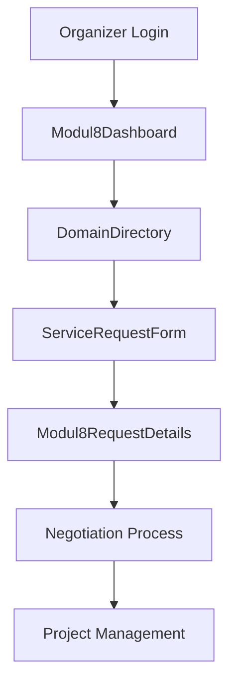
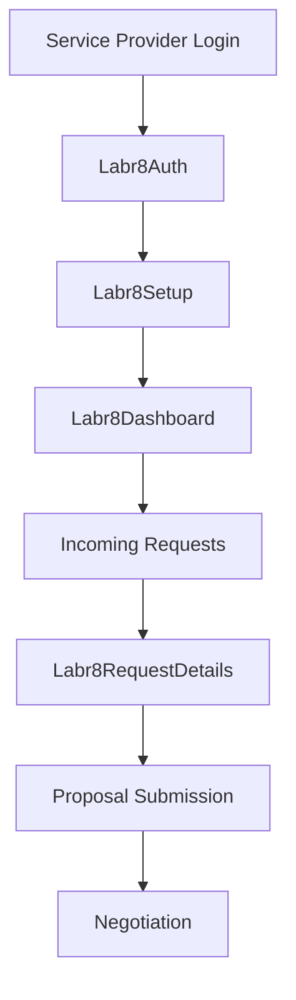
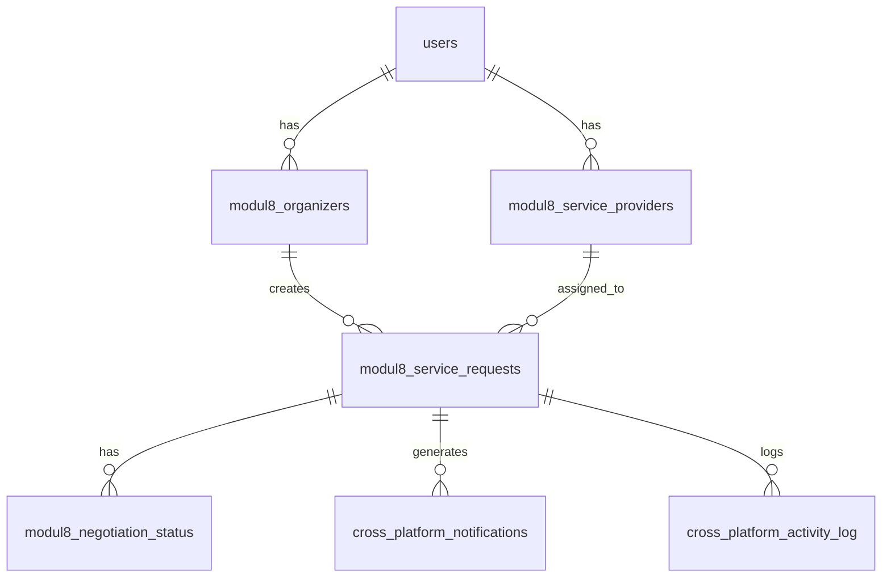

# Modul8 & Labr8 Architecture Documentation

## Overview

Modul8 and Labr8 are two interconnected platforms that facilitate service provider matching and project management:

- **Modul8**: Platform for organizers to post service requests and manage projects
- **Labr8**: Platform for service providers to respond to requests and manage their work

## Table of Contents

1. [App Routes Structure](#app-routes-structure)
2. [Modul8 Architecture](#modul8-architecture)
3. [Labr8 Architecture](#labr8-architecture)
4. [Cross-Platform Integration](#cross-platform-integration)
5. [Data Models](#data-models)
6. [Services Layer](#services-layer)
7. [Authentication & Authorization](#authentication--authorization)
8. [Key Components](#key-components)
9. [Database Schema](#database-schema)

## App Routes Structure

### Core Route Protection

The application uses three levels of route protection:

```typescript
// From AppRoutes.tsx
<NonServiceProviderRoute>     // Prevents service providers from accessing
<ProtectedRoute>              // Requires authentication
<ServiceProviderProtectedRoute> // Requires service provider role
```

### Modul8 Routes

```typescript
// Main Modul8 Routes
/modul8                    // Dashboard (Organizer view)
/modul8/dashboard         // Dashboard (Organizer view)
/modul8/projects          // Project management
/modul8/partners          // Partner management
/modul8/dashboard/directory // Service provider directory
/modul8/dashboard/request/new // Create new service request
/modul8/dashboard/request/:requestId // Request details
/modul8/setup/organizer   // Organizer setup wizard
```

### Labr8 Routes

```typescript
// Main Labr8 Routes
/labr8                    // Landing page
/labr8/auth              // Service provider authentication
/labr8/setup             // Service provider setup
/labr8/dashboard         // Service provider dashboard
/labr8/inbox             // Incoming requests
/labr8/dashboard/request/:requestId // Request details
```

## Modul8 Architecture

### Core Components

#### 1. Modul8Dashboard
- **File**: `src/pages/modul8/Modul8Dashboard.tsx`
- **Purpose**: Main organizer dashboard showing service domains
- **Key Features**:
  - Domain-based service provider discovery
  - Project overview
  - Partner management access

#### 2. DomainDirectory
- **File**: `src/pages/modul8/DomainDirectory.tsx`
- **Purpose**: Browse service providers by domain
- **Features**:
  - Filter by domain specialization
  - Provider profiles and ratings
  - Direct engagement options

#### 3. ServiceRequestForm
- **File**: `src/pages/modul8/ServiceRequestForm.tsx`
- **Purpose**: Create new service requests
- **Features**:
  - Domain selection
  - Budget and timeline specification
  - Milestone planning

#### 4. Modul8RequestDetails
- **File**: `src/pages/modul8/Modul8RequestDetails.tsx`
- **Purpose**: View and manage service request details
- **Features**:
  - Status tracking
  - Provider proposals
  - Negotiation interface

### Modul8 Data Flow



## Labr8 Architecture

### Core Components

#### 1. Labr8Dashboard
- **File**: `src/pages/labr8/Labr8Dashboard.tsx`
- **Purpose**: Main service provider dashboard
- **Key Features**:
  - Incoming request notifications
  - Active project management
  - Profile and portfolio management

#### 2. Labr8Auth
- **File**: `src/pages/labr8/Labr8Auth.tsx`
- **Purpose**: Service provider authentication
- **Features**:
  - Role-based authentication
  - Profile setup integration

#### 3. Labr8Setup
- **File**: `src/pages/labr8/Labr8Setup.tsx`
- **Purpose**: Service provider profile setup
- **Features**:
  - Business information
  - Service offerings
  - Portfolio links

#### 4. Labr8RequestDetails
- **File**: `src/pages/labr8/Labr8RequestDetails.tsx`
- **Purpose**: View and respond to service requests
- **Features**:
  - Request analysis
  - Proposal submission
  - Negotiation interface

### Labr8 Data Flow



## Cross-Platform Integration

### Shared Services

#### 1. Cross-Platform Service
- **File**: `src/services/crossPlatformService.ts`
- **Purpose**: Handles communication between Modul8 and Labr8
- **Key Functions**:
  - Negotiation status management
  - Cross-platform notifications
  - Activity logging

#### 2. Negotiation Hook
- **File**: `src/hooks/useCrossPlatformNegotiation.tsx`
- **Purpose**: Real-time negotiation state management
- **Features**:
  - Status synchronization
  - Activity tracking
  - Notification handling

### Integration Points

1. **Service Request Matching**: Modul8 organizers create requests that appear in Labr8 provider dashboards
2. **Proposal System**: Labr8 providers submit proposals visible to Modul8 organizers
3. **Negotiation Flow**: Real-time communication between platforms
4. **Project Management**: Shared project status and milestone tracking

## Data Models

### Core Types

#### ServiceProvider
```typescript
interface ServiceProvider {
  id: string;
  user_id: string;
  business_name: string;
  logo_url?: string;
  tagline?: string;
  description?: string;
  services: string[];
  tags: string[];
  pricing_range: {
    min?: number;
    max?: number;
    currency: string;
  };
  portfolio_links: string[];
  domain_specializations: number[];
  created_at: string;
  updated_at: string;
}
```

#### Organizer
```typescript
interface Organizer {
  id: string;
  user_id: string;
  organization_name: string;
  logo_url?: string;
  description?: string;
  focus_areas: string[];
  created_at: string;
  updated_at: string;
}
```

#### ServiceRequest
```typescript
interface ServiceRequest {
  id: string;
  organizer_id: string;
  service_provider_id?: string;
  domain_page: number;
  title: string;
  description?: string;
  budget_range: {
    min?: number;
    max?: number;
    currency: string;
  };
  timeline?: string;
  milestones: string[];
  status: 'pending' | 'negotiating' | 'agreed' | 'in_progress' | 'completed' | 'cancelled';
  engagement_status: 'none' | 'negotiating' | 'affiliated';
  project_progress?: number;
  created_at: string;
  updated_at: string;
}
```

### Domain Specializations

The system supports 8 specialized domains:

```typescript
const DOMAIN_PAGES = [
  { id: 1, title: 'Fundraising & Sponsorship' },
  { id: 2, title: 'Event Production & Logistics' },
  { id: 3, title: 'Legal & Compliance' },
  { id: 4, title: 'Marketing & Communications' },
  { id: 5, title: 'Technology & Digital Infrastructure' },
  { id: 6, title: 'Vendor & Marketplace Management' },
  { id: 7, title: 'Partnership Development & Collaboration' },
  { id: 8, title: 'Community Engagement & Relationship Management' }
];
```

## Services Layer

### Modul8Service
- **File**: `src/services/modul8Service.ts`
- **Key Functions**:
  - `createServiceProvider()`: Register new service providers
  - `createOrganizer()`: Register new organizers
  - `createServiceRequest()`: Create new service requests
  - `getUserServiceProvider()`: Get provider profile
  - `getUserOrganizer()`: Get organizer profile
  - `getProviderServiceRequests()`: Get provider's assigned requests
  - `getAvailableServiceRequestsForProvider()`: Get available requests for provider

### EnhancedModul8Service
- **File**: `src/services/enhancedModul8Service.ts`
- **Purpose**: Advanced project management features
- **Features**:
  - Milestone tracking
  - Progress updates
  - Completion workflows

### CrossPlatformService
- **File**: `src/services/crossPlatformService.ts`
- **Key Functions**:
  - `createNegotiationStatus()`: Track negotiation state
  - `updateNegotiationStatus()`: Update negotiation progress
  - `createCrossPlatformNotification()`: Send notifications
  - `logActivity()`: Track platform activities

## Authentication & Authorization

### Route Protection Levels

1. **NonServiceProviderRoute**: Prevents service providers from accessing organizer features
2. **ProtectedRoute**: Requires user authentication
3. **ServiceProviderProtectedRoute**: Requires service provider role

### User Context
- **File**: `src/contexts/UserContext.tsx`
- **Purpose**: Manages user state and role-based access
- **Features**:
  - Session management
  - Role validation
  - Profile data

## Key Components

### Navigation & Layout

#### CompactHeader
- **File**: `src/components/modul8/CompactHeader.tsx`
- **Purpose**: Consistent header across Modul8 pages
- **Features**:
  - Responsive design
  - Action buttons
  - Breadcrumb navigation

#### Labr8NavigationDrawer
- **File**: `src/components/navbar/Labr8NavigationDrawer.tsx`
- **Purpose**: Service provider navigation
- **Features**:
  - Dashboard access
  - Project management
  - Profile settings

### Project Management

#### ProjectStatusView
- **File**: `src/pages/modul8/ProjectStatusView.tsx`
- **Purpose**: Visual project progress tracking
- **Features**:
  - Milestone visualization
  - Progress indicators
  - Status updates

#### Labr8ProjectStatusNew
- **File**: `src/pages/labr8/Labr8ProjectStatusNew.tsx`
- **Purpose**: Service provider project view
- **Features**:
  - Task management
  - Progress reporting
  - Deliverable tracking

### Negotiation Components

#### NegotiationHandler
- **File**: `src/components/labr8/NegotiationHandler.tsx`
- **Purpose**: Real-time negotiation interface
- **Features**:
  - Proposal submission
  - Counter-offers
  - Status updates

#### AgreementCard
- **File**: `src/components/modul8/AgreementCard.tsx`
- **Purpose**: Display and manage agreements
- **Features**:
  - Terms review
  - Acceptance workflow
  - Contract generation

## Database Schema

### Core Tables

#### modul8_service_providers
- Stores service provider profiles and capabilities
- Links to user accounts via user_id
- Contains business information, services, and pricing

#### modul8_organizers
- Stores organizer profiles and organization details
- Links to user accounts via user_id
- Contains focus areas and organizational information

#### modul8_service_requests
- Central table for all service requests
- Links organizers to service providers
- Contains project details, budget, and status

#### modul8_negotiation_status
- Tracks negotiation progress between platforms
- Real-time status updates
- Historical negotiation data

#### cross_platform_notifications
- Handles communication between Modul8 and Labr8
- Real-time notifications
- Platform-specific messaging

#### cross_platform_activity_log
- Audit trail for all platform activities
- User action tracking
- Project history

### Key Relationships



## Development Guidelines

### Adding New Features

1. **Route Definition**: Add routes in `AppRoutes.tsx` with appropriate protection
2. **Component Creation**: Create components in respective platform directories
3. **Service Integration**: Extend services in `src/services/`
4. **Type Definitions**: Update types in `src/types/modul8.ts`
5. **Database Migration**: Create migrations for new tables/columns

### Cross-Platform Considerations

1. **Real-time Updates**: Use Supabase real-time subscriptions
2. **Notification System**: Implement cross-platform notifications
3. **Status Synchronization**: Maintain consistent state across platforms
4. **Activity Logging**: Log all user actions for audit trails

### Performance Optimization

1. **Lazy Loading**: Components are lazy-loaded for better performance
2. **Pagination**: Implement pagination for large datasets
3. **Caching**: Use React Query or similar for data caching
4. **Optimistic Updates**: Provide immediate UI feedback

## Testing Strategy

### Unit Tests
- Service layer functions
- Utility functions
- Component logic

### Integration Tests
- Cross-platform communication
- Database operations
- Authentication flows

### E2E Tests
- Complete user workflows
- Platform interactions
- Error scenarios

## Deployment Considerations

### Environment Variables
- Supabase configuration
- API endpoints
- Feature flags

### Database Migrations
- Run migrations before deployment
- Backup existing data
- Test migration rollbacks

### Monitoring
- Error tracking
- Performance monitoring
- User analytics

---

This documentation provides a comprehensive overview of the Modul8 and Labr8 architecture. For specific implementation details, refer to the individual component files and service implementations.
